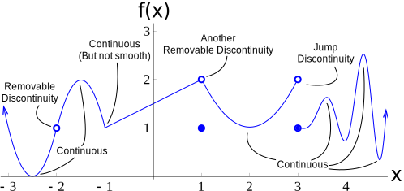
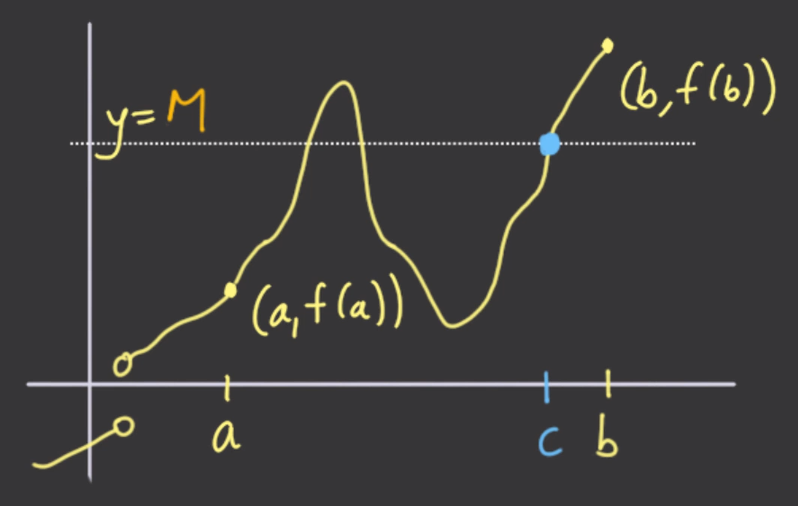

The concept of continuity is very intuitive. I mean, even a third grader can say whether a curve is continuous ("it has a hole in it, so it's not continuous"). But it's harder to define formally ("it has a hole in it" is never enough for mathematicians). Here's how mathematicians define it:

> A function $f(x)$ is continuous at $a$ if $f(a)$ exists and $\lim_{x \to a}f(x)=f(a)$.

This is saying that if we have a function $f(x)$, it's continuous at $a$ if:

- $f(a)$ exists — there isn't a\\hole in the graph
- $f(a)$ is where we expect it to be — it isn't floating above its neighbours

## The two types of discontinuity

If a function is discontinuous at some point, then it would be one of two cases:

- **Removable discontinuity:** there's just a hole in the graph (that part of the graph was **removed**), and we can easily patch it up by filling the value in
- **Jump discontinuity:** the function jumps from one value to a whole different value (the limits from both sides are not the same)

For example, take this function (image taken from the course):

I've labeled where things are continuous, and where things are discontinuous.

As we can see at $x=1$, $f(1)$ is a removable discontinuity, even though it still exists. At $x=3$, $f(x)$ suddenly *jumps* from 2 to 1, so it's a jump discontinuity.

## Properties of continuous functions

We can find some properties of continuous functions from our [properties of limits](./introduction-to-limits#some-properties-of-limits).

Suppose $f(x)$ and $g(x)$ are both continuous functions.

- $f(x) \pm g(x)$​ is continuous
- $f(x)g(x)$ is continuous
- But $\frac{f(x)}{g(x)}$ is continuous everywhere *except* when $g(x)=0$
  - If $g(x)$​ never intersects the x-axis, we're good to go
- $f(g(x))$​​​​ is continuous (also denoted with $f\circ g$​)

## A list of continuous functions

- Polynomials
- $\sqrt[3]{x}$
- $|x|$
- $\cos x$ and $\sin x$
- $a^x$​ where $a$ is positive
- $\sqrt x$ where $x\ge0$
- $\tan x$ where $x$ is defined
- $\log_ax$, where $a>0$ and $x>0$

## Intermediate Value Theorem

The intermediate value theorem states:

> If $f(x)$ is continuous in the interval $[a,b]$, and $M$ lies between the values of $f(a)$ and $f(b)$, there is at least one point $c$ between $a$ and $b$ such that $f(c)=M$

As we can see from the image, as long as $f$ is continuous between $a$ and $b$, there *has* to be an intersection. How else would the function get to $b$ then?
