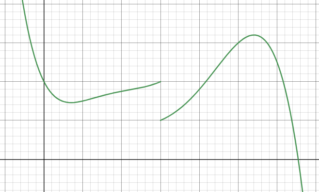

# Introduction to Limits

Limits are one of the foundations of calculus, but it's kind of hard to grasp their concept. I mean, when mathematicians say:
$$
\lim_{x \to 0}
$$
they're sort of saying:

> Let $x$​​ approach zero, but it's not really equal to zero. But for the sake of math, let's say that it's equal to zero and look for that value even if we divide by zero

Confusing, eh?

Let's start with the definition.

## Left- and Right-Hand Limits

Let's say we had a graph of a function, $f(x)$

Even though $f(a)$ is technically undefined, we still really want to know what $f(a)$ would be if it was defined. We have two options of attacking this problem — checking from the left (or the negative direction) and checking from the right (the positive direction).

In our case, it's 2 in the negative direction and 1 in the positive direction.

With math, we can express this as:
$$
\begin{align*}
\lim_{x \to a^-}f(a)&=2 \\
\lim_{x \to a^+}f(a)&=1
\end{align*}
$$
What this means is that, if we head towards $a$​ from the negative side, $f(a)$ should be 2. And if we approach it from the positive side, $f(a)$ should be 1.

Think of this as some kind of autocomplete, in which we can find the value of a function somewhere, even if it isn't there.

When the limits from both sides are the same, it's kind of annoying to write the values coming from both directions at the same time. So we can abbreviate this as just:
$$
\lim_{x \to a}f(a)=L
$$

## Some properties of Limits

$$
\text{Assume that $\lim_{x \to a}f(x)=L$ and $\lim_{x \to a}g(x)=M$.}
$$

$$
\begin{align*}
\text{Addition of Limits: }&\lim_{x \to a}[f(x)+g(x)]=L+M \\
\text{Subtraction of Limits:}&\lim_{x \to a}[f(x)-g(x)]=L-M \\
\text{Multiplication of Limits: }&\lim_{x \to a}[f(x)g(x)]=LM \\
\text{Division of Limits (Part 1): }&\lim_{x \to a}\frac{f(x)}{g(x)}=\frac L M\text{, if } M\ne0
\end{align*}
$$

