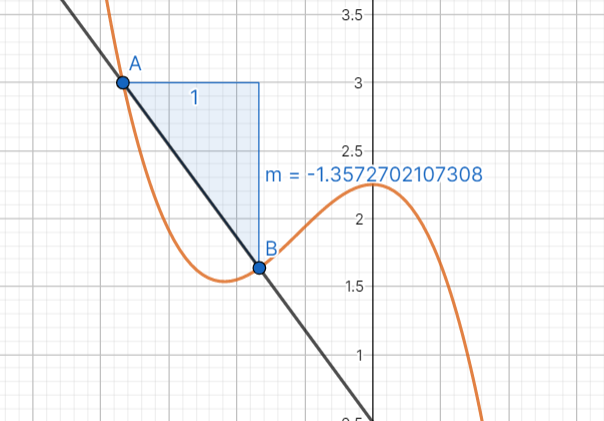
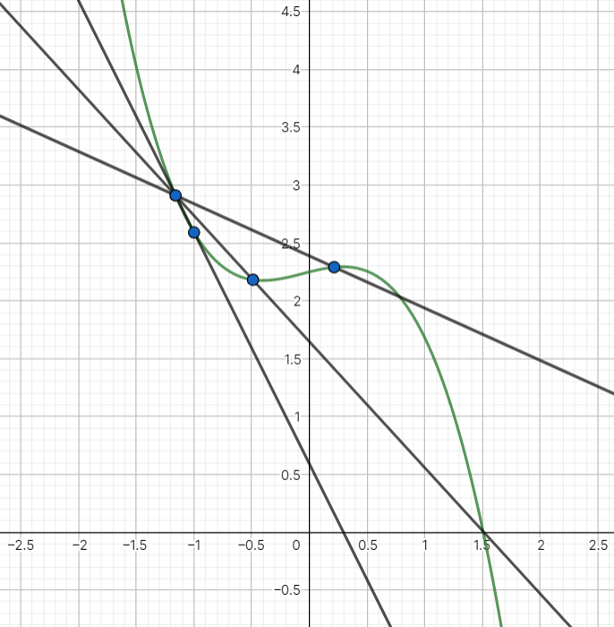
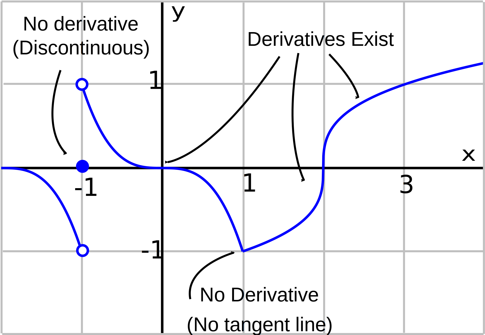

Our definition of the derivative from earlier is very nice, but — like everything else in math — is there another interpretation for this?

Recall our very simplified definition of the derivative:
$$
\frac {\Delta f}{\Delta x}
$$
Let's ignore the first little bit, and focus on the quotient. What does this resemble?

This is very similar to our formula for slope, $\frac{\Delta y}{\Delta x}$​. But look at what happens if we graph $f(x)$:

Our definition of the derivative corresponds to the slope of a secant line. And if we move $B$ closer:

Just as how moving $b$ closer to $a$ gets us the derivative, moving $B$ closer to $A$ gets us the slope of the tangent line. Using our geometric definition of derivatives, we can easily compute whether a derivative exists at all at a certain point without computing limits of a scary function:

Just by looking at the graph, we can easily tell whether a derivative exists (and approximate its value), but it would be tedious (and perhaps impossible) to actually find the derivative.

