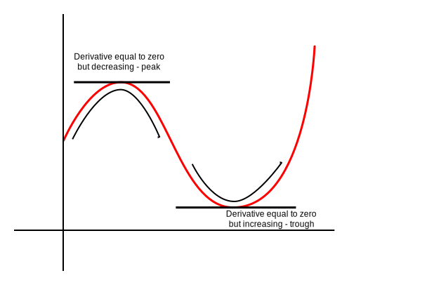

The derivative is very nice, but we can also have the *derivative* of a derivative. This will help us in:

- Physics (of course it had to be physics. Why would it not be physics)
- Graphing the derivative more accurately (because sometimes we just don't know how to derive a function and we need to make guesses)
- Helps us analyze functions

So first of all, we have the physics perspective. if we have a function $f(t)$​​ that represents a distance traveled after $t$​​ seconds, then $f'(t)$​​ would be the speed after $t$​​ seconds. So what would $f''(t)$​​ be? It's the rate at which the speed changes, which is acceleration. There's also [special physics names for the rate at which acceleration changes, the rate at which that rate changes, the rate at which the rate I just mentioned changes, and so on](https://en.wikipedia.org/wiki/Fourth,_fifth,_and_sixth_derivatives_of_position), which just becomes a game of giving the most creative names that relate to speeding up and slowing down possible.

We can also use the second derivative to graph derivatives. If derivatives are the tangent line to the function, the second derivatives are the rate at which the tangent lines steepen.

After staring my eyes out at the graphs of functions, their derivatives, and the derivative of their derivatives, I've noticed that we can determine whether a point is at a "peak" or a "trough" based on their derivatives and second derivatives.

This seems rather intuitive — if the derivative is decreasing, but it just so happens to equal zero, it means that that value is the largest it'll get. And if the derivative is increasing, but zero, then it means it'll be the lowest it'll get. If you don't understand this, I don't blame you, because this wasn't covered in the lectures. I just thought it up myself.

To find the second derivative, we just find the derivative, and find the derivative of that. And to find third derivatives, we find the derivative of *that*. And this process just goes on again and again.

Also, to represent second derivatives in Leibniz notation, we use $\frac{d^2}{dx^2}$​. And for third derivatives, we use $\frac{d^3}{dx^3}$​. For fourth derivatives, $\frac{d^4}{dx^4}$. And for fifth derivatives… you get the idea.​
