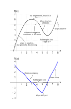

As we saw earlier, the derivative of a function is the slope of the function at that point, which is less of an oxymoron than our slightly more general definition. If that wasn't crazy, the derivative can also be viewed as a function.

Every time when we want to calculate a derivative, we have to repeat the same calculation ($\lim_{h\to0}\frac{f(a+h)-f(a)}h$​​) over and over again, which is kind of tedious. Is there a way to generalize this?

You can represent the derivative as a function.

With our understanding of derivatives, all we can do so far is to crudely approximate what the graph of the derivative would look like:

By approximating where slopes are increasing, decreasing, zero, at a minimum, etc., we can approximate what the graph of the derivative would look like.
