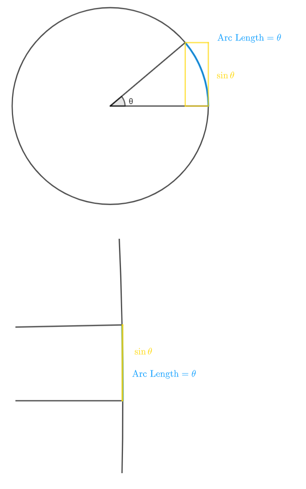

In addition to polynomials, sine and cosine are also relatively easy functions to derive. So let's do it.

The function $\sin\theta$ is wave-like and repeating, so we'd expect that its derivative will also resemble a wave in some way. Let's find out with our definition of the derivative

$$
\begin{align*}
\frac{d}{d\theta}\sin\theta=\lim_{\Delta\theta \to 0} \frac{\sin(\theta+\Delta\theta)-\sin\theta}{\Delta\theta}
&=\lim_{\Delta\theta \to 0} \frac{\sin\theta\cos\Delta\theta+\cos\theta\sin\Delta\theta-\sin\theta} {\Delta\theta} \\
&=\lim_{\Delta\theta \to 0} \sin\theta\left(\frac{\cos\Delta\theta-1}{\Delta\theta}\right)
 +\lim_{\Delta\theta \to 0} \frac{\cos\theta\sin\Delta\theta}{\Delta\theta} \\
&=\cos\theta\left(\lim_{\Delta\theta \to 0}\frac{\sin\Delta\theta}{\Delta\theta}\right)
\end{align*}
$$

So the derivative of $\sin\theta$​ is just $\cos\theta$​  times whatever $\frac{\sin\Delta\theta}{\Delta\theta}$​ is as $\Delta\theta \to 0$​. We can find this geometrically using just the definition of sine and a unit circle.

As we can see, for really small values of $\theta$, $\sin\theta=\theta$, so $\frac{\sin\Delta\theta}{\Delta\theta}=1$, and our whole derivative is just a simple $\cos\theta$.

Similarly, we can turn $\frac{d}{d\theta}\cos\theta$ into $\cos\theta\left(\frac{\cos\Delta\theta-1}{\Delta\theta}\right)-\frac{\sin\theta\sin\Delta\theta}{\Delta\theta}$, which is just $-\sin\theta\left(\frac{\sin\Delta\theta}{\Delta\theta}\right)$. Since we already know that $\frac{\sin\Delta\theta}{\Delta\theta}=1$, the whole thing just turns into $-\sin\theta$.
