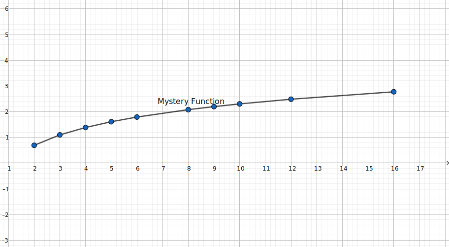

The power rule we used previously could only be used for constant powers. In lots of applications though, we want to find things like $2^x$ 

In nature, lots of things can be modelled with exponential functions. In short, anything that has to do with growth or decay involves exponential functions somewhere. Problem is, we can't really find the derivative of those functions yet. We have the power rule, but it just doesn't work

Let's try to figure it out.

Let's first try with $2^x$:

$$
\frac{d}{dx}2^x=\lim_{\Delta x\to0}\frac{2^{x+\Delta x}-2^x}{\Delta x}=\lim_{\Delta x\to0}\frac{2^x2^{\Delta x}-2^x}{\Delta x}=2^x\lim_{\Delta x\to0}\frac{2^{\Delta x}-1}{\Delta x}
$$

Notice that we used a property of exponents here. Let's try it with $a^x$, for any $a$ that doesn't break math

$$
\frac{d}{dx}a^x=\lim_{\Delta x\to0}\frac{a^{x+\Delta x}-a^x}{\Delta x}=\lim_{\Delta x\to0}\frac{a^xa^{\Delta x}-a^x}{\Delta x}=a^x\lim_{\Delta x\to0}\frac{a^{\Delta x}-1}{\Delta x}
$$

So it seems that the derivative of any exponent is just itself scaled by a mystery value. Since $a$ could be anything (it might as well stand for "anything"), let's just call it $M(a)$, so I don't have to type $\lim_{\Delta x\to0}\frac{a^{\Delta x}-1}{\Delta x}$ again and again later. We don't know what $M(a)$ could be, but what we can do at the very least is to try a few values of $a$, for really small (0.0001) values of $\Delta x$:

| $a$  | $M(a)$   |
| ---- | -------- |
| 2    | 0.693171 |
| 3    | 1.09867  |
| 4    | 1.38639  |
| 5    | 1.60957  |
| 6    | 1.79192  |
| 8    | 2.07966  |
| 9    | 2.19747  |
| 10   | 2.30285  |
| 12   | 2.48522  |
| 16   | 2.77297  |

It looks quite alien and unfamiliar if you plot these values out

Let's try something different.

Let's find a base such that the mystery function is one, and let's call that "$e$​", for "exponent." This means that the derivative of $e^x$​ will be $e^x$​. The slope of $e^x$ at $x=0$ would also be 1. This may seem like some random, comic idea, but it'll actually solve our problem of the mystery function.

I'm also going to introduce another concept. If you recall paying attention to Precalculus class, you probably remember something to do with logarithms, which are the inverses of exponents. The inverse of $e^x$ would then be $\log_e x$. Since $e^x$ seems kind of "natural" (I mean, its derivative is itself and its slope at $x=0$ is 1), let's just call it the natural logarithm, $\ln$. Since it'll be helpful later, let's also find the derivative of $\ln x$. We can either do implicit differentiation or our handy [inverse function property](./inverse-functions). I'll do both

$$
\frac{d}{dx}\ln x=\frac1{e^{\ln x}}=\frac1x
$$

$$
\begin{align*}
e^{\ln x}&=x \\
\frac{d}{dx} e^{\ln x}&=\frac{d}{dx} x \\
e^{\ln x}\cdot \frac{d}{dx}\ln x&=1 \\
\frac{d}{dx}\ln x&=\frac1x
\end{align*}
$$

Now let's return to our original question — what's the derivative of $a^x$?

One way to do this would be to substitute $a$​​ for $e^{\ln a}$​​, giving us $\left(e^{\ln a}\right)^x$​​. From the properties of exponents, we can find that this is equal to $e^{x\ln a}$​. Using the chain rule, we find that the derivative of that to be $e^{x\ln a}\cdot\frac{d}{dx}(x\ln a)=a^x\ln a$​. So the mystery function actually turned out to be $\ln a$​, since our other formula for the derivative of $a^x$​ was $a^x\cdot M(a)$​.

## Logarithmic Differentiation

There's actually another way to find the derivative too, which leads to yet another useful way of finding derivatives. Sometimes, it's hard to calculate the derivative of a function directly, so we calculate the derivative of its logarithm. But to do that, we must first find a quick formula for the derivative of a function's logarithm

$$
(\ln f)'=\ln'f\cdot f'=\frac{f'}f
$$

We can rearrange this and get that $f'=f\cdot(\ln f)'$.

Now back to our exponential function $a^x$.

$$
\frac{d}{dx}a^x=a^x\cdot\frac{d}{dx}\ln a^x=a^x\cdot\frac{d}{dx}x\ln a=a^x\ln a
$$

This technique of taking the derivative of logarithms (also called logarithmic differentiation) is actually very helpful when we have exponents and we can't take the derivative of it.

For an example to demonstrate the usefulness of logarithmic differentiation, let's say that we, for some reason, want to find the derivative of $\sqrt x^x$. This would be a nightmare to tackle without logarithmic differentiation, but we can easily (?) do this with logarithmic differentiation:

$$
\begin{align*}
\frac{d}{dx}\sqrt x^x
&=\sqrt x^x\cdot \frac{d}{dx}\left(\ln\sqrt x^x\right) \\
&=\sqrt x^x\cdot \frac{d}{dx}\left(\ln x^\frac x2\right) \\
&=\frac12\sqrt x^x\cdot \frac{d}{dx}(x\ln x) \\
&=\frac12\sqrt x^x\left(x(\ln x)'+\ln x\right) \\
&=\frac12\sqrt x^x(\ln x+1)
\end{align*}
$$
Note that we didn't apply the chain rule immediately. That would've defeated the whole purpose of logarithmic differentiation, because we'd be back with a sad little $\frac{d}{dx} \sqrt x^x$, and that's kind of useless.
