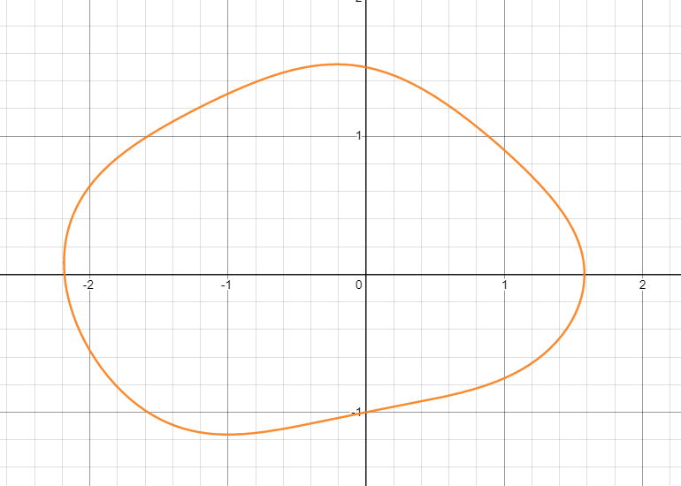

Finding the derivatives of functions is great, but a lot of times, our curve cannot be expressed with a function. I'll start with a simple example first. Suppose we have a circle with graph $x^2+y^2=1$, and we want to find the derivative at a point $(x,y)$. As we can see, circles are *not* functions, so we have to find another way to do this.

This is where implicit differentiation comes in. It's called "*implicit* differentiation" because the thing we're trying to differentiate is *implicit*, which means that the value of $y$​ or $f(x)$ or whatever is not exactly given to you as an expression for evaluating it, but rather trapped in an equation. Implicit equations are great for plotting random curves (like a potato), but they're a bit harder to differentiate.

So how do we find the derivative?

The whole process of implicit differentiation is basically getting a $\frac{dy}{dx}$ in the equation somewhere and solving it. This means that we take the derivative of both sides of the equation.

So with our example, $x^2+y^2=1$, we can take the derivative of both sides:
$$
\begin{align*}
\frac{d}{dx}\left(x^2+y^2\right)&=\frac{d}{dx}1 \\
\frac{d}{dx}x^2+\frac{d}{dx}y^2&=0
\end{align*}
$$

Now we encounter a bit of a problem: we can't exactly take the derivative of $y^2$ with respect to $x$. It just doesn't really work like that.

The key breakthrough here is that we express this in terms of something times the derivative of $y$ with respect to $x$ — that's what we're looking for, after all
$$
\begin{align*}
\frac{d}{dx}x^2+\frac{d}{dx}y^2&=0 \\
2x+\frac{dy}{dx}\cdot\frac{d}{dy}y^2&=0 \\
2y\cdot\frac{dy}{dx}&=-2x \\
\frac{dy}{dx}&=-\frac{2x}{2y}=-\frac xy
\end{align*}
$$
So if we know $x$ and $y$, this means that we can easily find the derivative.

Time for something a bit harder — a potato.

Suppose we want to find the derivative of $0.8x^{2}+2y^{2}+\sin x-y\cos^{2}x=3$, given $x$ and $y$:

We just take the derivative of both sides and do some algebra:
$$
\begin{align*}
\frac{d}{dx}\left(0.8x^2+2y^2+\sin x-y\cos^2x\right)&=\frac{d}{dx}3 \\
1.6x+\frac{d}{dx}2y^2+\cos x-\frac{d}{dx}\left(y\cos^2x\right)&=0 \\
1.6x+\frac{dy}{dx}\cdot4y+\cos x-\left(-2y\sin x\cos x+\cos^2x\cdot\frac{dy}{dx}\cdot 1\right)&=0 \\
1.6x+\frac{dy}{dx}\cdot4y+\cos x+2y\sin x\cos x-\cos^2x\cdot \frac{dy}{dx}&=0 \\
\frac{dy}{dx}\left(4y-\cos^2x\right)&=-\left(1.6x+\cos x+2y\sin x\cos x\right) \\
\frac{dy}{dx}&=-\frac{1.6x+\cos x+2y\sin x\cos x}{4y-\cos^2x} \\
\end{align*}
$$
Now suppose we want to know the slope at $(0,1.5)$​, we just plug it in and do some math:
$$
\begin{align*}
\frac{dy}{dx}&=-\frac{1.6x+\cos x+2y\sin x\cos x}{4y-\cos^2x} \\
&=-\frac{1.6\cdot0+\cos0+2\cdot1.5\sin0\cos0}{4\cdot1.5-\cdot\cos^20} \\
&=-\frac{0+1+3\cdot0\cdot1}{6-1} \\
&=-\frac1{5} \\
\end{align*}
$$
If we graph this out, it seems that it works.

---

Now I'm going to state how I *wish* implicit differentiation was introduced to me, since it was kind of confusing at first.

First of all, the whole point of going through all this hassle is because some curves can't exactly be represented with a clean function (for example, our potato curve), but we still want to find its derivative, $\frac{dy}{dx}$​. To squeeze a $\frac{dy}{dx}$​​ out of our equation, we take the derivative of both sides. All of our $x$​ terms would be differentiated as they should. As for our $y$​ terms, since we can't differentiate a bunch of $y$​'s with respect to $x$​. We can imagine $y$​ as a *function* of $x$​ (not really the truth, but calculus is all about assuming that things exist even when they don't), and use the chain rule. For example, if we have $\frac{d}{dx}3y^2$​, we use the chain rule and turn this into $\frac{dy}{dx}\cdot\frac{d}{dy}3y^2$. After that, we just algebra the equation until we get a clean formula for $\frac{dy}{dx}$.