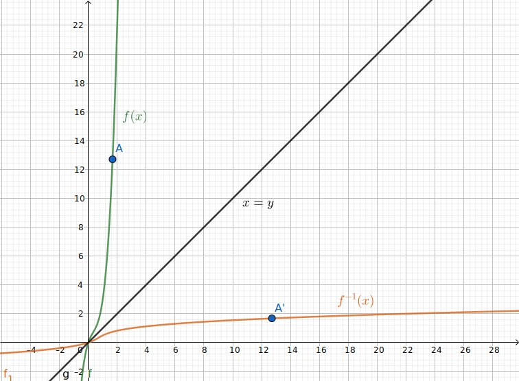
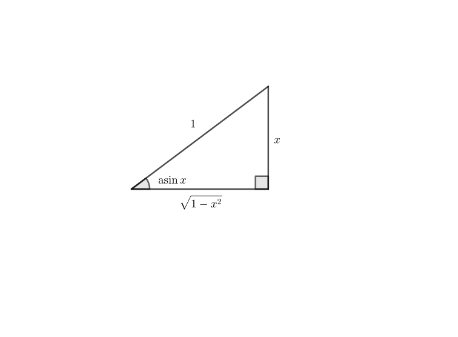
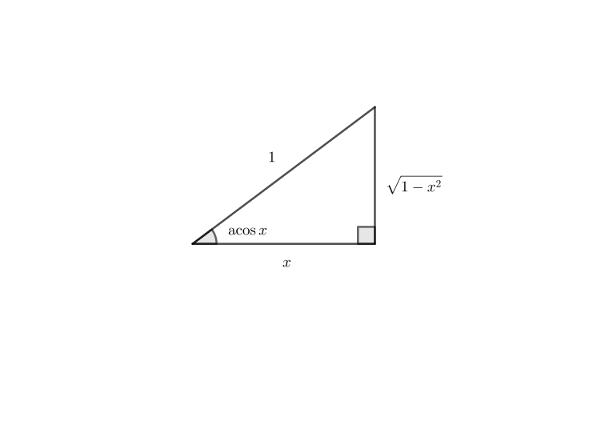
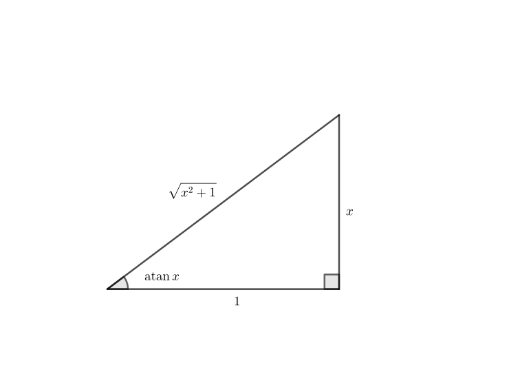
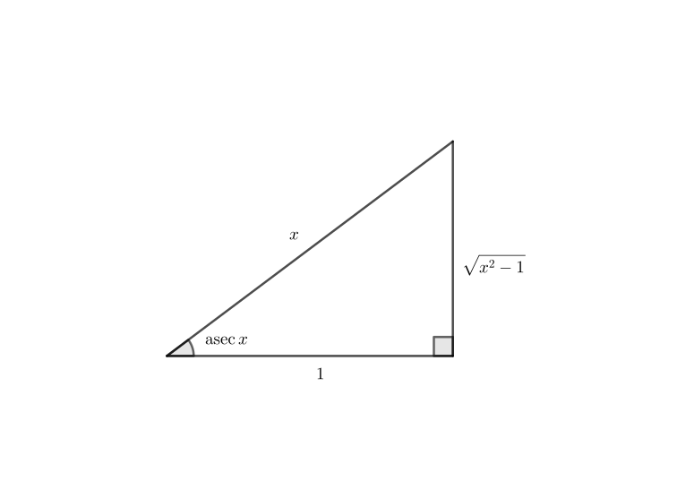

Functions are great. We can map values to other values. But what if we want to go from our output to our input? That's exactly the point of inverse functions. By definition,

$$
f^{-1}(f(x))=x
$$

Which basically means that applying a function, then applying an inverse function has the combined effect of doing nothing at all. This is also a two-way process, so we also have

$$
f(f^{-1}(x))=x
$$

And also, if we graph out $f(x)$​ and $f^{-1}(x)$​, we see that they're just mirror images of each other, reflected across the line $x=y$

Inverse functions also have interesting derivative properties too.

For example, let's see what we can get by messing around with our definition of inverse functions.

Our definition of inverse functions is

$$
f(f^{-1}(x))=x
$$

We can take the derivative of both sides, which leads to the chain rule. And the chain rule is always fun.

$$
\begin{align*}
\frac{d}{dx} f(f^{-1}(x)) &= \frac{d}{dx} x \\
f'(f^{-1}(x)) \cdot \frac{d}{dx} f^{-1}(x) &= 1 \\
\frac{d}{dx} f^{-1}(x) &= \frac 1 {f'(f^{-1}(x))}
\end{align*}
$$

And now we can find the derivative of a function's inverse given that function's derivative and its inverse (of the function, not the function's derivative). Although this doesn't seem very helpful at first (you can easily find the derivative of something if you know what it is), you'll see how helpful it is. In fact, you'll see in the next section

### Derivatives of Inverse Trig Functions

You know our great friends, the trig functions? Well, they've got inverses. And their inverses also have derivatives.

The trig functions have very funny names. We have stuff like sine, tangent, and secant, and we add this "co" prefix to make cosine, cotangent, and cosecant. This "co" prefix has the effect of shifting and flipping them for some reason. Well, we also have this "arc" prefix that we can stick onto everything to get funny names like "arccosine," "arctangent," and my favourite, "arccosecant," which has a total of four very nice-sounding syllables. Of course, there's also these [dusty, long-forgotten functions](https://en.wikipedia.org/wiki/List_of_trigonometric_identities#Historical_shorthands) such as "archavercosine," "exsecant," and "versine," but hardly anyone uses them these days.

Anyways, along with $\arcsin$ and abbreviations like $\asin$, we can also express inverse trig functions the normal way, namely $\sin^{-1}$. Because I'm too lazy to type four extra keys, most of the time I'll be using $\asin$, but you'll see me use them interchangeably.

So first of all, we want to find $\frac{d}{dx} \asin x$​. We can use our identity about inverse functions

$$
\frac{d}{dx} \asin x = \frac 1 {\sin'(\asin x)} = \frac 1 {\cos(\asin x)}
$$

This presents us with a bit of a problem, because we don't really know how to find the cosine of an arcsine. But we can use a right triangle to clear up this confusion

So our angle is $\asin x$, meaning that the cosine is $\sqrt{1 - x^2}$. Now we throw this back into the equation and get

$$
\frac{d}{dx} \asin x = \frac 1 {\cos(\asin x)} = \frac 1 {\sqrt {1 - x^2}}
$$

This strategy will recur again and again for the other inverse trig functions, so if you ever have to find the derivative of an inverse trig function, just remember this right triangle.

Next we have $\acos x$. Again, we can use our identity and find

$$
\frac {d}{dx} \acos x = \frac 1 {\cos'(\acos x)} = -\frac 1 {\sin(\acos x)}
$$

Again, we can draw a right triangle, but slightly different.

And now we find that the answer is practically the same, but negative. In other words, $\frac{d}{dx} \acos x = -\frac 1 {\sqrt{1 - x^2}}$.

But now the important question — *why is it negative?*

In each case, we set up the right triangle such that the inverse trig function was one of the angles in the triangle. When we took the derivative of the normal trig function, it gave us the other side, which was always $\sqrt{1 - x^2}$. The derivative of sine is cosine and the derivative of cosine is sine (but negative). Because the result of the derivative corresponds to the same thing, the two derivatives of the inverses were negatives of each other.

Now we find the derivative of the inverse of another trig function duo — tangent and cotangent.

The derivative of tangent is $\sec^2$ and the derivative of cotangent is $-\csc^2$. Again, they're negatives of each other, and they're also co- something. So we can predict that the derivatives are going to be negative again.

Let's try it.

As we can see again, our angle $\theta$​ is $\atan x$​, and now the derivative of $\tan x$​, which is $\sec^2 x$​, is the square of the hypotenuse, which is $x^2+1$​. So putting it together, the derivative of $\atan$​ is $\frac1{x^2+1}$​. And if we look at the triangle for $\cot$​ (which I'm not going to draw to save time), it seems that the derivative of $\acot$​ is $-\frac1{x^2+1}$​. So our prediction that the derivative of an inverse trig function is the negative of the derivative or that inverse trig function's cofunction.

Now we have one more pair we haven't looked at yet — $\sec$ and $\csc$. Their derivatives are $\sec\tan$ and $-\csc\cot$​, respectively. Again, they're co-functions of each other, just multiplied and negated.

We draw the triangle one last time, but this time for $\sec$:

The derivative of $\sec$​ is a bit more complicated. $\sec'\theta$​ turns out to be $\sec\theta\tan\theta$​, which, if you do the algebra, turns out to be $\frac1{x\sqrt{x^2-1}}$​. If you already knew what the derivative was beforehand, you'd know that the $x$​ is supposed to be an $|x|$​​​. This really confused me at first when I tried to graph it out (one reason why you should always check your work by graphing it). Apparently, [other](https://math.stackexchange.com/questions/3999672/why-doesnt-my-derivation-of-the-arcsec-derivative-formula-not-work) [people](https://math.stackexchange.com/questions/3735966/why-the-derivative-of-inverse-secant-has-an-absolute-value) had the same question, which saved a lot of time for me. Our right triangle only works if $x$​ is nonnegative, since our right triangle can't have a negative hypotenuse. So when our hypotenuse is "negative," the tangent is negative too, so the whole derivative is negated. That's what gives rise of the absolute value of $x$​. Cosecant is pretty much the same — just negated.

So this sums up the derivatives of our inverse trig functions:

$$
\begin{align*}
\frac{d}{dx} \sin^{-1} x &= \frac 1 {\sqrt{1 - x^2}} \\
\frac{d}{dx} \cos^{-1} x &= -\frac 1 {\sqrt{1 - x^2}} \\
\frac{d}{dx} \tan^{-1} x &= \frac 1 {x^2 + 1} \\
\frac{d}{dx} \cot^{-1} x &= -\frac 1 {x^2 + 1} \\
\frac{d}{dx} \sec^{-1} x &= \frac 1 {|x| \sqrt{x^2 - 1}} \\
\frac{d}{dx} \csc^{-1} x &= -\frac 1 {|x| \sqrt{x^2 - 1}} \\
\end{align*}
$$