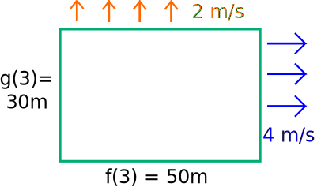

A lot of times, we'll have to find the *product* of two functions, which is a bit of a problem since we can't really do this. So how do we do this?

First of all, let me point out what *won't* work — multiplying the derivatives of the function. Think of it this way. If functions $f(t)$​​ and $g(t)$​​ output some number in meters, then $h(t)=f(t)g(t)$​​ would output something in meters2. And now the derivatives of $f$​ and $g$​ are in $\frac ms$. The derivative of $h$ is in $\frac{m^2}s$. But multiplying the derivatives of $f$ and $g$ would give us something in $\frac{m^2}{s^2}$, which is *not* what we want. So it's not as simple as a multiplication.

So *how* do we do it?

Normally in math, when you see two things being multiplied together, we think *rectangle*. So here's an example rectangle:

For our example here, $f(3)=50$​​​​​, $f'(3)=4$​​​​​, $g(3)=30$​​​​​, and $g'(3)=2$​​​​​. $h(3)$​​​​​ is just the area of the rectangle (which is $f(3)g(3)$​​​​). $h'(3)$​​​​ is how fast the area is changing at the moment — this is just the sum of three (really thin) rectangles. There's the one at the top, which has a width of $50m$​​​​ and a height of $2\frac ms$​​​​ (which doesn't really make sense, but let's just say that $\frac ms$​​​​ also counts as a "side length"), and the one at the right, which has a width of $4\frac ms$​​​​ and a height of $30m$​​​. We also have this tiny rectangle at the corner which has a width of $4\frac ms$​​ and a height of $2\frac ms$​​, which makes even less sense than the other two rectangles. The rate at which our area is increasing is just the sum of these three rectangles. Since our "rectangles" are supposed to have really small width, our top-right rectangle has literally no area compared to the other two, so we can ignore that one. Our other two rectangles have an area of $100\frac{m^2}s$ and $120\frac{m^2}s$, which sounds absurd, but it'll clear up soon. But anyways, we can add these two "areas" and get $220\frac{m^2}s$ as our derivative.

In general, the derivative of $f(x)g(x)$ is $f(x)g'(x)+f'(x)g(x)$.

However, this proof is not very rigourous. So here's a more rigorous one.

---

Let $h(x)=f(x)g(x)$. Then,

$$
\begin{align*}
h'(x)=\lim_{\Delta x \to 0}\frac{\Delta h}{\Delta x}
&=\lim_{\Delta x \to 0}\frac{h(x+\Delta x)-h(x)}{\Delta x} \\
&=\lim_{\Delta x \to 0}\frac{f(x+\Delta x)g(x+\Delta x)-f(x)g(x)}{\Delta x} \\
&=\lim_{\Delta x \to 0}\frac{f(x+\Delta x)g(x+\Delta x)-f(x)g(x+\Delta x)+f(x)g(x+\Delta x)-f(x)g(x)}{\Delta x} \\
&=\lim_{\Delta x \to 0}\frac{g(x+\Delta x)[f(x+\Delta x)-f(x)]+f(x)[g(x+\Delta x)-g(x)]}{\Delta x} \\
&=    \lim_{\Delta x \to 0}g(x+\Delta x)
\cdot \lim_{\Delta x \to 0}\frac{f(x+\Delta x)-f(x)}{\Delta x} \\
&+    \lim_{\Delta x \to 0}f(x)
\cdot \lim_{\Delta x \to 0}\frac{g(x+\Delta x)-g(x)}{\Delta x} \\
&=g(x)f'(x)+f(x)g'(x)
\end{align*}
$$

---

One thing to note is that, like the sum rule, the power rule can be generalized to multiple terms. For example, if we want to know $(uvw)'$, we have:

$$
\begin{align*}
(uvw)'&=[(uv)w]' \\
      &=(uv)w'+(uv)'w \\
      &=uvw'+(u'v+uv')w \\
      &=uvw'+u'vw+uv'w \\
\end{align*}
$$

We can also write this as $(uvw)'=u'vw+uv'w+uvw'$. We can then use this to find $(uvwz)'$, and so on.
